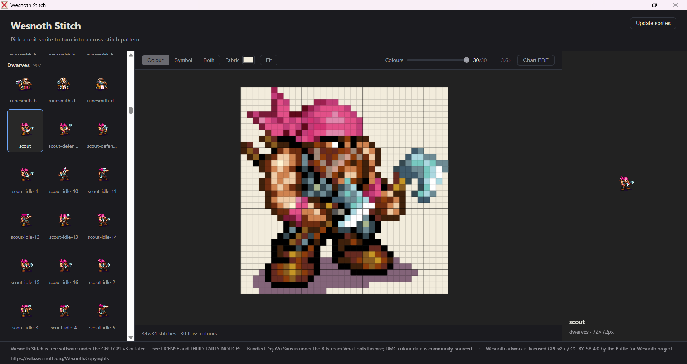

# Wesnoth Stitch

Turn [Battle for Wesnoth](https://www.wesnoth.org/) unit sprites into **cross-stitch
patterns**. Pick a unit, choose how many thread colours you want, and export a printable PDF
chart with stitch symbols and a DMC floss shopping list. One sprite pixel = one stitch.

<!-- Screenshot goes here once docs/screenshot.png is added:
 -->

## Download and install (Windows)

1. Go to the **[Releases page](https://github.com/gemlad/wesnoth_stitch/releases)** and
   download the latest **`wesnoth-stitch-…-setup.exe`**.
2. Double-click it to install. It installs **just for you** — no administrator password
   needed — and adds a Start-menu and desktop shortcut.

### "Windows protected your PC" — this is expected

Wesnoth Stitch is a small free app and isn't code-signed, so Windows SmartScreen will show a
blue **"Windows protected your PC"** box the first time. To continue:

1. Click **More info**.
2. Click **Run anyway**.

That's it — you'll only see this once. (If you'd rather not, you can check the file first: the
installer is exactly the one attached to the Release above.)

## First run: getting the sprites

The unit sprites aren't bundled with the app — they're downloaded the **first time you open
Wesnoth Stitch**. They're a copy of the official Battle for Wesnoth unit art, hosted alongside
the app so it's a single quick download.

- It's a **one-time download of a few megabytes** and needs an internet connection just this
  once. You'll see a progress bar; when it finishes, the sprite browser fills in.
- Later, if Wesnoth updates its art, use the **"Update sprites"** button (top-right) to pull
  the newest set. Any sprites you've added to the folder yourself are kept.

## Making a pattern

1. **Pick a unit** from the browser on the left.
2. **Choose your colours.** The slider sets how many DMC thread colours the pattern uses. It
   starts at the sprite's own colour count; drag it down to simplify (great for a quicker
   stitch or a smaller floss list).
3. **Set your fabric colour** so the preview matches the cloth you'll actually stitch on.
4. **Export the chart.** You'll get a multi-page PDF: a cover with the finished size at common
   Aida counts, a floss key (each colour's DMC code, name, symbol and stitch count), and the
   chart pages themselves with a symbol in every cell and bold lines every 10 stitches.

**Print the PDF at 100% / "actual size"** (not "fit to page") — the chart is laid out at a real
physical size so the symbols stay legible and the finished dimensions are correct.

## Licence and credits

- **Wesnoth Stitch** itself is free software under the **GNU GPL v3 or later** — see
  [`LICENSE`](LICENSE).
- **The unit sprites** are © the Battle for Wesnoth project, licensed **GPL v2+ / CC-BY-SA
  4.0** ([Wesnoth:Copyrights](https://wiki.wesnoth.org/Wesnoth:Copyrights)). A cross-stitch
  chart you make from them is a derivative work, so **please credit the Battle for Wesnoth
  project** if you share it — the app already prints that credit on every chart page.
- Bundled **DejaVu Sans** (Bitstream Vera Fonts License) and community-sourced **DMC colour
  data** — full notices in [`THIRD-PARTY-NOTICES.md`](THIRD-PARTY-NOTICES.md).

## For developers

The design docs and milestone breakdowns live in [`docs/`](docs/). The original Python CLI
that started all this is in [`prototype/`](prototype/) with its
[own README](prototype/README.md). Building from source needs Node (version pinned in
`.node-version`): `npm install`, then `npm run dev` to run the app or `npm run build:win` to
build the installer — see [`docs/RELEASING.md`](docs/RELEASING.md).
